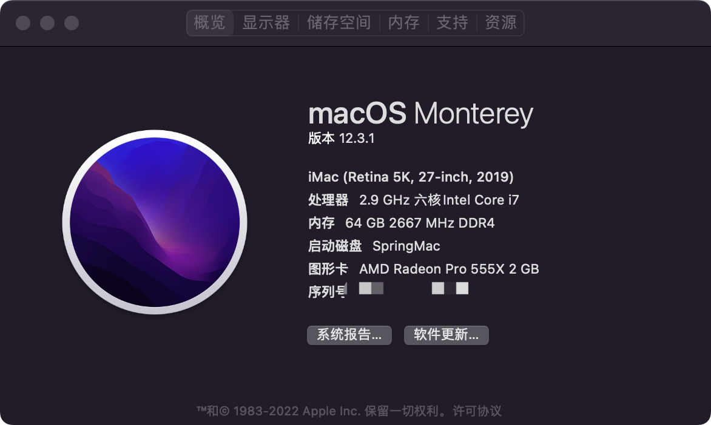

# MSI-MAG-Z390-TOMAHAWK-Hackintosh

Opencore EFI for MSI-MAG-Z390-TOMAHAWK

## MSI MAG Z390 TOMAHAWK + i7-8700ES(QN8H)

### 当前版本信息

| 信息                                                         | 版本                |
| ------------------------------------------------------------ | ------------------- |
| 系统                                                         | macOS BigSur 11.3.1 |
| [OpenCore](https://github.com/acidanthera/OpenCorePkg/releases) | 0.7.9               |
| 模拟机型                                                     | iMac19,1            |
| [Lilu.kext](https://github.com/acidanthera/Lilu/releases)    | 1.6.0               |
| [VirtualSMC.kext](https://github.com/acidanthera/VirtualSMC/releases) | 1.2.9               |
| [WhateverGreen.kext](https://github.com/acidanthera/WhateverGreen/releases) | 1.5.8               |
| [AppleALC.kext](https://github.com/acidanthera/AppleALC/releases) | 1.7.0               |
| [IntelMausi.kext](https://github.com/acidanthera/IntelMausi/releases) | 1.0.7               |
| [AppleIGB.kext](https://github.com/Shaneee/AppleIGB)   | 5.7.2               |
| [CPUFriend.kext](https://github.com/acidanthera/CPUFriend)   | 1.2.3               |

### 电脑配置信息

| 硬件     | 型号                                  |
| :------- | ------------------------------------- |
| 处理器   | Intel i7-8700ES                        |
| 主板     | MSI MAG Z390 TOMAHAWK                 |
| 内存     | 鯨枭 16GB DDR4 3200MHz * 4          |
| 硬盘     | HIKVISION C2000 PRO 1T                |
| 显卡     | Sapphire AMD RX550 2G                 |
| 无线蓝牙 | Broadcom BCM94360CS2 Wireless LAN SoC |
| 电源     | CoolerMaster V550                     |
| 散热器   | Thermalright AS120 PLUS               |
| 显示器   | PHL 276E8V 27'' 4K * 2                   |
| 鼠标     | Logitech MX Master 3                  |
| 键盘     | Keychron K1                 |
| 机箱     | JONSBO U4                             |

### 功能完善程度

- [x] 显卡：UHD630核显 + RX590独显 双硬解，可输出4k+和HEVC解码
- [x] 声卡：Realtek ALC892 已驱动，输出输入均正常
- [x] 网卡：Intel I219-V + Intel I211AT 已驱动
- [x] WiFi：BCM94360CS2 免驱
- [x] 蓝牙：BCM94360CS2 免驱
- [x] USB：USB2.0 + USB3.0 + USB-C接口均已定制
- [x] Airdrop隔空投送：功能正常
- [x] Handoff接力：功能正常
- [x] Sidecar随航：功能正常
- [x] FaceTime/iMessage：功能正常
- [x] CPU睿频 / HWP变频：功能正常
- [x] 睡眠唤醒：功能正常

### 安装教程

#### BIOS设置

> 本人当前BIOS版本：E7B18IMS.160，如下面设置选项未找到，请[更新最新版本](https://cn.msi.com/Motherboard/support/MAG-Z390-TOMAHAWK)。
>
> 同时请设置语言为简体中文并进入高级模式（F7）。

必要设置：

- OC(Overclocking) -> CPU 特征 -> Intel 虚拟化技术 **[允许]**
- OC(Overclocking) -> CPU 特征 -> Intel VT-D 技术 **[禁止]**
- OC(Overclocking) -> CPU 特征 -> CFG锁定 **[禁止]**

按需设置：

- STTINGS -> 高级 -> 内建显示配置 -> 设置第一显卡 **[PEG]**  *(仅同时拥有核显及独显需要手动设置)*
- STTINGS -> 高级 -> 内建显示配置 -> 集显共享内存 **[64M]** *(如果使用拥有核显的处理器)*
- STTINGS -> 高级 -> 内建显示配置 -> 集成显卡多显示器 **[允许]** *(如果使用拥有核显的处理器)*
- STTINGS -> 高级 -> PCI子系统设置 -> Above 4G memory/Crypto Currency mining **[允许]**
- STTINGS -> 高级 -> USB设置 -> XHCI Hand-off **[允许]**
- STTINGS -> 高级 -> USB设置 -> 传统USB支持 **[允许]**
- STTINGS -> 高级 -> 电源管理设置 -> ErP Ready **[允许]**
- STTINGS -> 高级 -> Windows操作系统的配置 -> Windows 10 WHQL支持 **[允许]**
- STTINGS -> 高级 -> 唤醒事件设置 -> 唤醒事件管理 **[BIOS]**
- STTINGS -> 高级 -> 唤醒事件设置 -> USB设备从S3/S4/S5唤醒 **[允许]** *(设置后我这边出现关机下键盘灯仍亮着情况。如出现一样情况，建议关闭，可按电源键唤醒)*

#### 修改config.plist文件

> 修改plist文件建议用[OCAuxiliaryTools](https://github.com/ic005k/OCAuxiliaryTools/releases/tag/20220204)工具。
>
> 修改参考这两位大神的文章：[xjn 博客](https://blog.xjn819.com/?p=543) [黑果小兵博客](https://blog.daliansky.net/OpenCore-BootLoader.html)

- 修改三码
  1. 使用[GenSMBIOS](https://github.com/corpnewt/GenSMBIOS)脚本生成三码+ROM（机型填`iMac19,1`）
  2. 用[OCAuxiliaryTools](https://github.com/ic005k/OCAuxiliaryTools/releases/tag/20220204)工具打开`config.plist`文件，进入`PlatformInfo` -> `Generic ` 填入三码。

### 结语

现在黑苹果的安装上手难度已经非常低了，希望这个EFI文件能够帮助你尽快上手黑苹果。

本EFI文件可随意使用。不出意外的话，本人将会止步在10.15版本，后续不再升级macOS新版本。

### 更新记录

- 2022年04年17日
  - 更新OpenCore 0.7.9
  - 更新Kexts到新版本
  - 更换最新的2.5g网卡的驱动AppleIGB

- 2021年03年08日
  - 更新OpenCore 0.6.9
  - 更新Kexts到新版本
  - 修复核显UHD 630驱动

### 预览截图

### 鸣谢

- [acidanthera / OpenCorePkg](https://github.com/acidanthera/OpenCorePkg)
- [Opencore Desktop Guide](https://dortania.github.io/OpenCore-Desktop-Guide/
  )
- [xjn](https://blog.xjn819.com/)
- [黑果小兵](https://blog.daliansky.net/)
- [远景论坛](http://bbs.pcbeta.com)
- [GeQ1an](https://github.com/GeQ1an/MSI-B360M-MORTAR-HACKINTOSH-OPENCORE-EFI)
